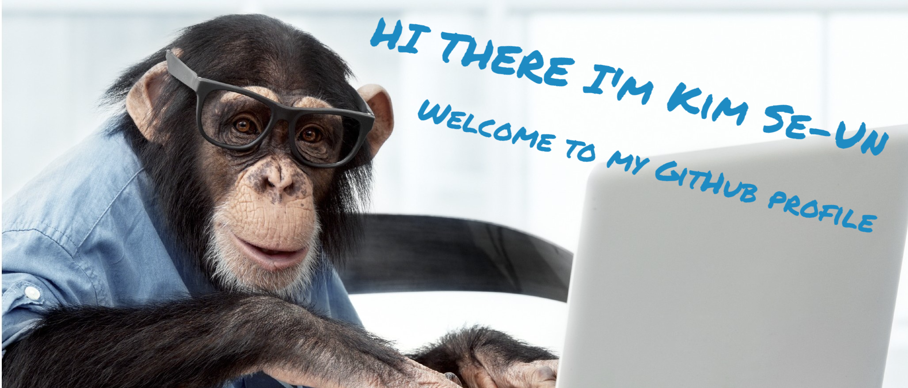

## About me: 
* I'm currently learning programming
* I write clean and understandable code
* Know about my experiences [CV](https://spb.hh.ru/resume/a8076163ff0ce127950039ed1f5852746e4b6c)
* Write to me on [Telegram](https://t.me/skim1994)

## Languages and Tools

  
  
  
  
  
  
  
  
  
  
  

## Statistics

  <h1>Contact me:</h1>
  
  

